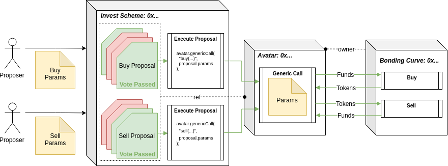
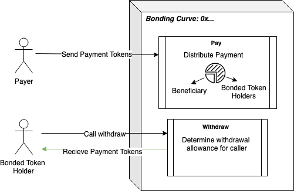

`NOTE: Do not use these contracts in production! All contracts in this repository are currently in alpha stage unless stated otherwise.`

# Bonding Curves For DAOs 
Bonding Curves are a mechanism for continuous token distribution. By serving as an automatic market-maker for a token, the mechanism can guarantee liquidity and certain price bounds without relying on exchanges.

If combined with dividend functionality, bonding curves could enable DAOs to continuously fundraise. This type of fundraising might allow for more flexibility, accountability, and alignment of incentives than alternative methods (such as ICOs or private fundraising).

In this document, we'll describe how to configure your DAO to: 
1. Deploy and administer its own Bonding Curve 
2. Invest in Bonding Curves 

*Note that the "Admin" & "Invest" schemes described below have been created for a specific bonding curve implementation, and cannot be used for all implementations. See the "Bonding Curve" section below to better understand the initial implementation we're building and supporting. In the future, more schemes will be developed to support different bonding curve implementations.* 

# Admin Scheme: Deploy & Administrate 
**[Feature]** 
The Admin Scheme enables a DAO to deploy new curves and administer existing curves owned by the DAO Avatar. Some examples of administrative functions may include: 
- Changing Parameters
- Transferring Ownership

## Architecture 
 

## Usage 
[**`proposeDeploy`**](./contracts/Schemes/BondingCurveAdminScheme.sol): Create a proposal that, when passed & executed, will deploy the bonding curve with the specified parameters. Before calling this function, the curve's parameters must be set using the [`setCurveParameters`](./contracts/Schemes/BondingCurveAdminScheme.sol) function. This will return the hash of the parameters, which should be then passed to `proposeDeploy`'s `bytes32 _curveParams` argument. 
```
function proposeDeploy(
 Avatar _avatar,
 string memory _name,
 string memory _symbol,
 address payable _beneficiary,
 bytes32 _curveParams
) public returns(bytes32)
```
```
function setCurveParameters(
 uint256 _buySlope,
 uint256 _sellSlope,
 uint256 _buyIntercept,
 uint256 _sellIntercept,
 ERC20 _reserveToken,
 uint256 _splitOnPay
) public returns(bytes32)
```

[**`propose{Admin_Func}`**](./contracts/Schemes/BondingCurveAdminScheme.sol): Create a proposal that, when passed & executed, will call the specified "Admin Function" that only the owning avatar can call. It does this through a "Generic Call", which invokes the specified function through the Avatar, making the Avatar == msg.sender. An example of an "Admin Function" Proposal is [`proposeChangeBeneficiary`](./contracts/Schemes/BondingCurveAdminScheme.sol). 
```
function proposeChangeBeneficiary(
 Avatar _avatar,
 BondingCurve _curve,
 address payable _newBeneficiary
) public returns (bytes32)
```

[**`executeProposal`**](./contracts/Schemes/BondingCurveAdminScheme.sol): This will be called by the voting machine when the proposal's vote has passed. This will in turn call the proposal's type-specific execute functions (ex: [`_executeDeploy`](./contracts/Schemes/BondingCurveAdminScheme.sol)).
```
function executeProposal(bytes32 _proposalId, int256 _param)
external
onlyVotingMachine(_proposalId)
returns(bool)
```

TODO: link to auto generated contract docs (still WIP, Milestone 2) 

## Setup 
**Scheme Deployment**: This is a universal scheme, meaning it is deployed once and used for N number of DAOs. (TODO: tell readers where to find the address) 

**DAO Configuration**: This scheme can be added to a DAO's controller just like any other through the [`SchemeRegistrar`](https://github.com/daostack/arc/blob/master/contracts/universalSchemes/SchemeRegistrar.sol). NOTE: This scheme requires the [`Generic Action` permission](https://github.com/daostack/arc/blob/f5e16c2b78d85e7290b32b145524667e80c405e3/contracts/controller/UController.sol#L19) (5th bit `0x00000010`). 

## Contract Docs 
TODO: link to auto generated contract docs (still WIP, Milestone 2) 

# Invest Scheme: Buy & Sell 
**[Feature]** 
The Invest Scheme enables a DAO to buy and sell from bonding curves. Additionally it provides support for any other token utility functionality, such as claiming dividends. 

## Architecture 
 

## Usage 
[**`proposeBuy`**](./contracts/Schemes/BondingCurveInvestScheme.sol): Create a proposal that, when passed & executed, will call the buy function on the bonding curve on behalf of the Avatar. 
```
function proposeBuy(
 Avatar _avatar,
 BondingCurve _curve,
 uint256 _tokensToSpend
) public returns(bytes32)
```

[**`proposeSell`**](./contracts/Schemes/BondingCurveInvestScheme.sol): Create a proposal that, when passed & executed, will call the sell function on the bonding curve on behalf of the Avatar. 
```
function proposeSell(
 Avatar _avatar,
 BondingCurve _curve,
 uint256 _tokensToSell
) public returns(bytes32)
```

[**`executeProposal`**](./contracts/Schemes/BondingCurveInvestScheme.sol): This will be called by the voting machine when the proposal's vote has passed. This will in turn call the proposal's type-specific execute functions (ex: [`_executeBuy`](./contracts/Schemes/BondingCurveInvestScheme.sol)).
```
function executeProposal(bytes32 _proposalId, int256 _param)
external
onlyVotingMachine(_proposalId)
returns(bool)
```

## Setup 
**Scheme Deployment**: This is a universal scheme, meaning it is deployed once and used for N number of DAOs. (TODO: tell readers where to find the address) 

**DAO Configuration**: This scheme can be added to a DAO's controller just like any other through the [`SchemeRegistrar`](https://github.com/daostack/arc/blob/master/contracts/universalSchemes/SchemeRegistrar.sol). NOTE: This scheme requires the [`Generic Action` permission](https://github.com/daostack/arc/blob/f5e16c2b78d85e7290b32b145524667e80c405e3/contracts/controller/UController.sol#L19) (5th bit `0x00000010`). 

## Contract Docs 
TODO: link to auto generated contract docs (still WIP, Milestone 2) 

# Bonding Curve 
**[Utility]** Our initial bonding curve implementation supports linear and Bancor-based curves, dividend distributions for bonded token holders, and a front-running guard via user-specified min and max prices.

### Key Terms

* **bondingCurve**: The 'avatar' of the bonding curve. It serves as the external interface to interact with the curve, with automated market maker and dividend tracking functions.
* **bondedToken**: Token native to the curve. The bondingCurve contract has exclusive rights to mint and burn tokens.
* **collateralToken**: Token accepted as collateral by the curve. (e.g. WETH or DAI)
* **reserve**: Balance of collateralTokens that the curve holds. The reserve is used to pay bondedToken holders when they want to liquidate and sell their tokens back to the curve.
* **beneficiary**: Entity that receives funding from the purchase of bondedTokens. This would typically be the DAO Avatar.
* **splitOnBuy**: Percentage of incoming collateralTokens distributed to beneficiary on buy(). This is implicitly set by the spread between the buy and sell curves at a given point. The remaining portion is added to the reserve.
* **splitOnPay**: Percentage of incoming collateralTokens distributed to beneficiary on pay(). This is an explicit parameter, with the remainder being distributed among current bondedToken holders.

### Key Actions
The following chart describes the actions users can take to interact with the Bonding Curve:

| Action | Actor | Analogy | Actor sends.. | bondedToken are.. | collateralTokens are.. | bondedToken price.. |
| --- | --- | --- | --- | --- | --- | --- |
| Buy() | Anyone, _except beneficiary_ | "Investment" | collateral token | minted to sender | split between reserve and beneficiary based on splitOnBuy % | increases |
| Buy() | _beneficiary_ | "Buyback" | collateral token | minted to sender | fully deposited in reserve | increases |
| Sell() | Anyone | "Divestment" | bonded token | burned | transferred to specified recipient | decreases |
| Pay() | Anyone | "Dividend" | collateral token | not changed | split between bondedToken holders and beneficiary based on splitOnPay % | remains the same |

  * The functionality that is used when the beneficiary initiates a buy() action is still under active discussion [here](https://github.com/dOrgTech/BC-DAO/issues/16)

#### Buy Flow


#### Payment Flow


## Setup 
**Deployment** Bonding Curves can be deployed via a BondingCurveFactory. We will provide factories as part of the universal scheme, though users can also choose to deploy how they see fit.

Bonding Curves are composed of several contracts, though the factory abstracts the need to know about them individually:
* Bonding Curve
* Bonded Token
* Buy Curve Logic
* Sell Curve Logic


## Usage 
[**`priceToBuy`**](./contracts/BondingCurve/BondingCurve.sol): Determine the current price in collateralTokens to buy a given number of bondedTokens.
```
function priceToBuy(
 uint256 numTokens
) public
```

[**`rewardForSell`**](./contracts/BondingCurve/BondingCurve.sol): Determine the current payout in collateralTokens to sell a given number of bondedTokens.
```
function rewardForSell(
 uint256 numTokens,
) public
```

[**`buy`**](./contracts/BondingCurve/BondingCurve.sol): Buy a given number of bondedTokens with an amount of collateralTokens determined by the current rate from the buy curve. The caller can specify the maximum total price in collateralTokens they're willing to pay, and a recipient address to transfer the new bondedTokens to.

The appropriate amount of collateralTokens must have previously been approved for the bonding curve contract by the caller.
```
function buy(
 uint256 numTokens,
 uint256 maxPrice,
 address recipient
) public
```

[**`sell`**](./contracts/BondingCurve/BondingCurve.sol): Sell a given number of bondedTokens for an amount of collateralTokens determined by the current rate from the sell curve. The caller can set a minimum total value of collateralTokens they're willing to sell for, and a recipient to transfer the proceeds of the sale to.
```
function sell(
 uint256 numTokens,
 uint256 minPrice,
 address recipient
) public
```

[**`pay`**](./contracts/BondingCurve/BondingCurve.sol): Pay the DAO in collateralTokens. Revenue send in this method is distributed between the beneficiary and the bondedToken holders according to the splitOnPay parameter;
```
function pay(
 uint256 amount
) public
```

[**`withdraw`**](./contracts/BondingCurve/BondingCurve.sol): Withdraw collateralToken dividends sender is entitled to for a given period, in blocks.
```
function withdraw(
 uint start,
 uint end
) public
```

## Current Limitations
- **Dividends are only distributed on pay()** - Without hooks on ERC20 transfers, we can't execute distribution logic when ERC20 tokens are transferred to the BondingCurve via the standard transfer() method. Ideally, we could allow 'native' ERC20 payments to function just as pay() does.

   * We'll be incorporating ERC777 hooks, which will alleviate this issue for tokens that adopt that standard.

- **Dividend tracking has significant gas costs** - With bondedTokens represented as ERC20s, we need additional data to track who is entitled to what dividend payments. This is currently implemented in a manner similar to [MiniMe Token](https://github.com/Giveth/minime/blob/master/contracts/MiniMeToken.sol), but this approach has significant gas costs.

   * We have an open discussion on this issue, and alternative implementations, [here](https://github.com/dOrgTech/BC-DAO/issues/5).

- **Payments directly to DAO Avatar can circumvent dividends** - It's possible for actors to bypass the bonding curve and send payments directly to the DAO Avatar. If customers pay the DAO directly rather than sending payment with the pay() function to the bonding curve, then the DAO would receive 100% of the payment, effectively cutting out token holders from receiving their cut.

   * For instance, DutchX fees might initially be configured to hit the pay() function on the bonding curve, resulting in continuous cash-flows to both token-holders (in the form of claimable dividends) and the DAO according to **splitOnPay**. However, the DAO might vote to re-route the fees directly to itself, avoiding the pay split with token holders.

   * We believe that the chances of such a coordinated attack will remain extremely low– as long as the prospects for continued funding are valued more than the present level of cash-flows. If the DAO was detected trying to "cheat" its token-holders in this way, we would expect a chain reaction of sell-offs and little to no prospect for future buys. Thus, the DAO would short-sightedly lose all ability to fundraise and would need to rely solely on its existing sources of revenue.

   * We have an open discussion on this issue [here](https://github.com/dOrgTech/BC-DAO/issues/4).

## Future Plans
We envision the following features may be useful to DAOs implementing bonding curves.

### Financial Features
- **Hatching** - An initial buying phase where selling is disabled up until a certain amount of tokens are bought. This helps ensure a certain amount of return for early investors.
- **Vesting** - Vesting periods can be added to minted tokens, which helps fight against pumping and dumping.
- **Taxes** - A % fee for selling back to the market can be added to encourage secondary market trading.
- **Governance via BondedTokens** - Voting power can be granted to token holders, which can help further insulate their potentially risky investment.
- **Multicurrency Reserve** - Allow multiple tokens to be added to reserve as collateralTokens.

### Regulatory Features
- **KYC / Whitelisting** - DAOs may wish to ensure that bonding curve investments only come from KYC'ed ethereum addresses. The [TPL standard](https://tplprotocol.org/) designed by Open Zeppelin offers a standard to incorporate this functionality.

### Security Features

- **Additional Front-running Guards** - Several variants of order batching have been outlined in the community. In addition, maximum gas prices for transactions may offer a simple mechanic to discourage front-running.

### Technical Features
- **Modularity** - We envision an "OpenZeppelin for bonding curves" - an open source repo to compose your own bonding curve from a suite of well-established components.


## Contract Docs 
TODO: link to auto generated contract docs (still WIP, Milestone 2) 
