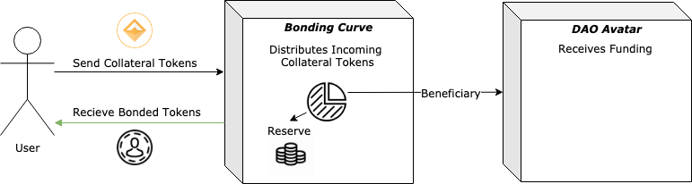
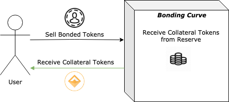

`NOTE: Do not use these contracts in production! All contracts in this repository are currently in alpha stage unless stated otherwise.`

# Fundraising Module For DAOs

BC-DAO is a fundraising module for projects and organizations to issue tokens and raise money to fund their vision. The core of this implementation is a **bonding curve**, or automated market maker - as conceptualized by individuals such as [Simon dela Rouviere]([https://medium.com/@simondlr/tokens-2-0-curved-token-bonding-in-curation-markets-1764a2e0bee5](https://medium.com/@simondlr/tokens-2-0-curved-token-bonding-in-curation-markets-1764a2e0bee5)) and [Billy Rennekamp]([https://medium.com/@billyrennekamp/converting-between-bancor-and-bonding-curve-price-formulas-9c11309062f5](https://medium.com/@billyrennekamp/converting-between-bancor-and-bonding-curve-price-formulas-9c11309062f5)) to enable continuous funding(cOrg link) for organizations, coupled with guaranteed liquidity for investors without relying on exchanges.

Tokens issued via BC-DAO can offer rights in the DAO, such as **dividends** on future revenue or **governance rights** through token locking.

This type of fundraising might allow for more flexibility, accountability, and alignment of incentives than alternative methods (such as ICOs or private fundraising).

## How it works

- Anyone can deposit a specified reserve token (such as DAI) to purchase bonded tokens.
- The **bonding curve** is an automated market maker contract that mints tokens to buyers at an algorithmically determined price. The automated market maker allows users to buy or sell tokens at any time for known prices with minimal slippage.
- When a user **buys** bonded tokens: Reserve tokens are split between the DAO treasury (to fund the organization) and the reserve (to facilitate liquidity for sells). The buyer receives bonded tokens based on the current price.



- When a user **sells** bonded tokens: The bonded tokens are burned and the seller receives reserve tokens based on the current price.



- When the DAO earns **revenue:** the income is split between direct income to the DAO treasury and **dividends** for the bonded token holders.


## Curve Economics

- The specifics of curve design are an area of active innovation. A common general principle is to reward early adopters significantly without inflating the buy price so high that it disincentives later participation.

- Our current curve implementation is based on **bancor formula**, which allows for a wide variety of potential curves with simple parameters.


[Bancor Whitepaper](https://storage.googleapis.com/website-bancor/2018/04/01ba8253-bancor_protocol_whitepaper_en.pdf)

## Dividend Tracking

* Scalable dividends purely on-chain is a challenge due to computation and storage costs. We've designed a Merkle-tree based payment pool based on the [Cardstack implementation](https://github.com/cardstack/merkle-tree-payment-pool) that uses Merkle proofs to enable highly scalable dividend distributions with minimal on-chain cost.
  
* From a users perspective, the mechanism functions in a conceptually similar way to stock dividends. For each **claim period** (the duration of which can be specified by the DAO), a snapshot of bonded token balances is taken and users can withdraw dividends proportional to their holdings at that time.

* For each claim period, a new merkle root is calculated by a DAO member via [our library](https://github.com/statesauce/merkle-tree-payment-pool) and uploaded as a proposal to the DAO. The full information is stored on IPFS. Once the DAO ratifies this proposal, the member who generated the merkle root is compensated for their efforts and token holders are able to withdraw for the period.

* For a discussion of the potential vulnerabilities of this approach and their mitigation, please see the 'Current Limitations' section.

* We have an alternative dividend implementation based on the [MiniMe Token](https://github.com/Giveth/minime/blob/master/contracts/MiniMeToken.sol) for a simpler approach that requires significantly more on-chain computation.

# Implementation

# Bonding Curve

Our initial bonding curve implementation supports linear and Bancor-based curves, dividend distributions for bonded token holders, and a front-running guard via user-specified min and max prices.

### Key Terms

- **bondingCurve**: The ‘avatar’ of the bonding curve. It serves as the external interface to interact with the curve, with automated market maker and dividend tracking functions.
- **bondedToken**: Token native to the curve. The bondingCurve contract has exclusive rights to mint and burn tokens.
- **collateralToken**: Token accepted as collateral by the curve. (e.g. WETH or DAI)
- **reserve**: Balance of collateralTokens that the curve holds. The reserve is used to pay bondedToken holders when they want to liquidate and sell their tokens back to the curve.
- **beneficiary**: Entity that receives funding from the purchase of bondedTokens. This would typically be the DAO Avatar.
- **splitOnBuy**: Percentage of incoming collateralTokens distributed to beneficiary on buy(). This is implicitly set by the spread between the buy and sell curves at a given point. The remaining portion is added to the reserve.
- **splitOnPay**: Percentage of incoming collateralTokens distributed to beneficiary on pay(). This is an explicit parameter, with the remainder being distributed among current bondedToken holders.

### Key Actions

The following chart describes the actions users can take to interact with the Bonding Curve:
| Action           | Actor                        | Analogy      | Actor sends..    | bondedToken are..                | collateralTokens are..                                                  | bondedToken price.. |
| ---------------- | ---------------------------- | ------------ | ---------------- | -------------------------------- | ----------------------------------------------------------------------- | ------------------- |
| Buy()            | Anyone, _except beneficiary_ | "Investment" | collateral token | minted to sender                 | split between reserve and beneficiary based on splitOnBuy %             | increases           |
| BeneficiaryBuy() | _beneficiary_                | "Investment" | collateral token | minted to sender (_beneficiary_) | fully deposited in reserve (none sent to _beneficiary_)                 | increases           |
| Sell()           | Anyone                       | "Divestment" | bonded token     | burned                           | transferred to specified recipient                                      | decreases           |
| Pay()            | Anyone                       | "Dividend"   | collateral token | not changed                      | split between bondedToken holders and beneficiary based on splitOnPay % | remains the same    |

#### Buy Flow


#### Payment Flow


## Setup

**Deployment** Bonding Curves can be deployed by a DAO via a BondingCurveFactory. We will provide a factory for this "one-click deployment", though users can of course choose to deploy how they see fit.

Bonding Curves are composed of several contracts, though the factory abstracts the need to know about them individually:
* Bonding Curve
* Bonded Token
* Buy Curve Logic
* Sell Curve Logic


## Usage 
[**`priceToBuy`**](./contracts/BondingCurve/BondingCurve.sol): Determine the current price in collateralTokens to buy a given number of bondedTokens.
```
function priceToBuy(
 uint256 numTokens
) public
```

[**`rewardForSell`**](./contracts/BondingCurve/BondingCurve.sol): Determine the current payout in collateralTokens to sell a given number of bondedTokens.
```
function rewardForSell(
 uint256 numTokens,
) public
```

[**`buy`**](./contracts/BondingCurve/BondingCurve.sol): Buy a given number of bondedTokens with an amount of collateralTokens determined by the current rate from the buy curve. The caller can specify the maximum total price in collateralTokens they're willing to pay, and a recipient address to transfer the new bondedTokens to.

The appropriate amount of collateralTokens must have previously been approved for the bonding curve contract by the caller.
```
function buy(
 uint256 numTokens,
 uint256 maxPrice,
 address recipient
) public
```

[**`sell`**](./contracts/BondingCurve/BondingCurve.sol): Sell a given number of bondedTokens for an amount of collateralTokens determined by the current rate from the sell curve. The caller can set a minimum total value of collateralTokens they're willing to sell for, and a recipient to transfer the proceeds of the sale to.
```
function sell(
 uint256 numTokens,
 uint256 minPrice,
 address recipient
) public
```

[**`pay`**](./contracts/BondingCurve/BondingCurve.sol): Pay the DAO in collateralTokens. Revenue send in this method is distributed between the beneficiary and the bondedToken holders according to the splitOnPay parameter;
```
function pay(
 uint256 amount
) public
```

[**`withdraw`**](./contracts/BondingCurve/BondingCurve.sol): Withdraw collateralToken dividends sender is entitled to for a given period, in blocks.
```
function withdraw(
 uint start,
 uint end
) public
```

## Current Limitations
- **Dividends are only distributed on pay()** - Without hooks on ERC20 transfers, we can't execute distribution logic when ERC20 tokens are transferred to the BondingCurve via the standard transfer() method. Ideally, we could allow 'native' ERC20 payments to function just as pay() does.

   * We'll be incorporating ERC777 hooks, which will alleviate this issue for tokens that adopt that standard.

- **Dividend tracking has significant gas costs** - With bondedTokens represented as ERC20s, we need additional data to track who is entitled to what dividend payments. This is currently implemented in a manner similar to [MiniMe Token](https://github.com/Giveth/minime/blob/master/contracts/MiniMeToken.sol), but this approach has significant gas costs.

   * We are incorporating a Merkle proof-based approach. We discuss this and alternative implementations [here](https://github.com/dOrgTech/BC-DAO/issues/5).

- **Payments directly to DAO Avatar can circumvent dividends** - It's possible for actors to bypass the bonding curve and send payments directly to the DAO Avatar. If customers pay the DAO directly rather than sending payment with the pay() function to the bonding curve, then the DAO would receive 100% of the payment, effectively cutting out token holders from receiving their portion.

   * For instance, DutchX fees might initially be configured to hit the pay() function on the bonding curve, resulting in continuous cash-flows to both token-holders (in the form of claimable dividends) and the DAO according to **splitOnPay**. However, the DAO might vote to re-route the fees directly to itself, avoiding the pay split with token holders.

   * We believe that the chances of such a coordinated attack will remain extremely low – as long as the prospects for continued funding are valued more than the present level of cash-flows. If the DAO was detected trying to "cheat" its token-holders in this way, we would expect a chain reaction of sell-offs and little to no prospect for future buys. Thus, the DAO would short-sightedly lose all ability to fundraise and would need to rely solely on its existing sources of revenue.

   * We have an open discussion on this issue [here](https://github.com/dOrgTech/BC-DAO/issues/4).

- **An incorrect dividend merkle root can steal dividends from token holders**
   * The potential for a DAO user uploading an incorrect root (say, one that entitles them to all the dividends) should be largely mitigated by the consensus layer of the DAO, which should have an incentive to maintain the value of their bonded token rather than steal one payment periods worth of funds from holders. Staking & slashing mechanics could also be formalized.

  * However, this mechanic is still potentially vulnerable to exploits if the DAO recieves a large windfall payment during a claim period. This is an area of active discussion.

## Future Plans
We envision the following features may be useful to DAOs implementing bonding curves.

### Financial Features
- **Hatching** - An initial buying phase where selling is disabled up until a certain amount of tokens are bought. This helps ensure a certain amount of return for early investors.
- **Vesting** - Vesting periods can be added to minted tokens, which helps fight against pumping and dumping.
- **Taxes** - A % fee for selling back to the market can be added to encourage secondary market trading.
- **Governance via BondedTokens** - Voting power can be granted to token holders, which can help further insulate their potentially risky investment.
- **Multicurrency Reserve** - Allow multiple tokens to be added to reserve as collateralTokens.

### Regulatory Features
- **KYC / Whitelisting** - DAOs may wish to ensure that bonding curve investments only come from KYC'ed ethereum addresses. The [TPL standard](https://tplprotocol.org/) designed by Open Zeppelin offers a standard to incorporate this functionality.

### Security Features

- **Additional Front-running Guards** - Several variants of order batching have been outlined in the community. In addition, maximum gas prices for transactions may offer a simple mechanic to discourage front-running.

### Technical Features
- **Modularity** - We envision an "OpenZeppelin for bonding curves" - an open source repo to compose your own bonding curve from a suite of well-established components.


## Contract Docs 
TODO: link to auto generated contract docs (still WIP, Milestone 2) 
