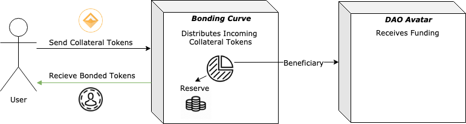
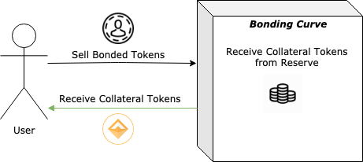
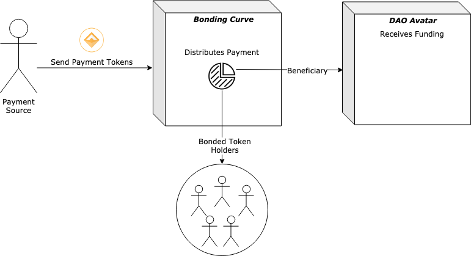
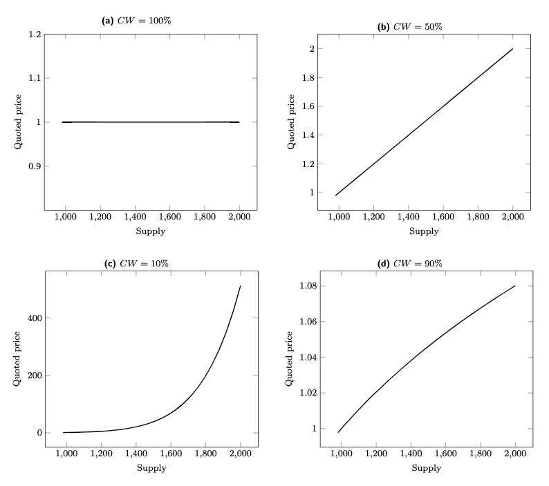
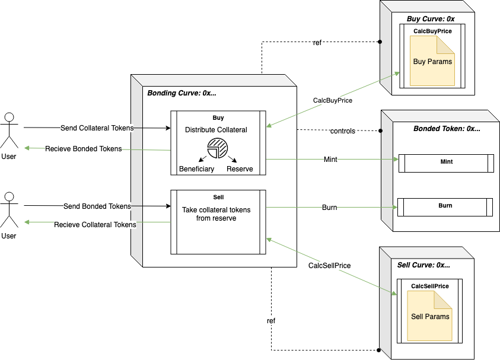
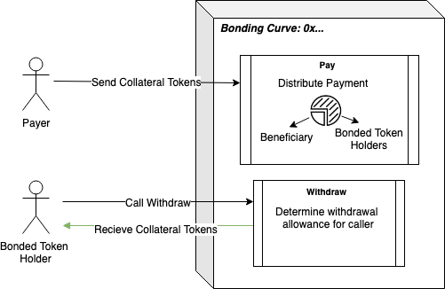

# Bonding Curve Fundraising

The bonding curve fundraising module enables projects and organizations to issue tokens and raise money to fund their vision. The core of this implementation is a **bonding curve**, or automated market maker - as conceptualized by individuals such as [Simon de la Rouviere](https://medium.com/@simondlr/tokens-2-0-curved-token-bonding-in-curation-markets-1764a2e0bee5), [Billy Rennekamp](https://medium.com/@billyrennekamp/converting-between-bancor-and-bonding-curve-price-formulas-9c11309062f5) and [Thibauld Favre](https://github.com/C-ORG/whitepaper) to enable continuous funding for organizations, coupled with guaranteed liquidity for investors without relying on exchanges.

Tokens issued via bonding curves can offer rights in the organization, such as **dividends** on future revenue or **governance rights**.

This type of fundraising might allow for more flexibility, accountability, and alignment of incentives than alternative methods (such as ICOs or private fundraising).

## How it works

- Anyone can deposit a specified collateral token (such as DAI) to purchase bonded tokens.
- The **bonding curve** is an automated market maker contract that mints tokens to buyers at an algorithmically determined price. The automated market maker allows users to buy or sell tokens at any time for known prices with minimal slippage.
- When a user **buys** bonded tokens with collateral tokens: The collateral tokens are split between the beneficiary treasury (to fund the organization) and the reserve (to facilitate liquidity for sells). The buyer receives bonded tokens based on the current price.



- When a user **sells** bonded tokens: The bonded tokens are burned and the seller receives collateral tokens based on the current price.



- When the beneficiary earns **revenue:** the income is split between direct income to the beneficiary treasury and **dividends** for the bonded token holders.



## Curve Economics

- The specifics of curve design are an area of active research. A common general principle is to reward earlier contributors without inflating the buy price so high that it disincentivizes later participation.

- Our current curve implementation is based on the **bancor formula**, which allows for a wide variety of potential curves with simple parameters.
  

[Bancor Whitepaper](https://storage.googleapis.com/website-bancor/2018/04/01ba8253-bancor_protocol_whitepaper_en.pdf)

# Implementation

Our initial bonding curve implementation supports:

- Bancor-based curves.
- Dividend distributions for bonded token holders.
- A front-running guard via user-specified min and max prices.

### Key Terms

- **bondingCurve**: The ‘avatar’ of the bonding curve. It serves as the external interface to interact with the curve, with automated market maker and dividend tracking functions.
- **bondedToken**: Token native to the curve. The bondingCurve contract has exclusive rights to mint and burn tokens.
- **collateralToken**: Token accepted as collateral by the curve. (e.g. ETH or DAI)
- **reserve**: Balance of collateralTokens that the curve holds. The reserve is used to pay bondedToken holders when they want to liquidate and sell their tokens back to the curve.
- **beneficiary**: Entity that receives funding from the purchase of bondedTokens.
- **reservePercentage**: Percentage of incoming collateralTokens sent to reserve on buy(). The remainder is sent to beneficiary.
- **dividendPercentage**: Percentage of incoming collateralTokens distributed to bondedToken holders on pay(). The remainder is sent to beneficiary.

### Key Actions

The following chart describes the actions users can take to interact with the Bonding Curve:

| Action           | Actor                        | Analogy      | Actor sends..    | bondedToken are..                | collateralTokens are..                                                          | bondedToken price.. |
| ---------------- | ---------------------------- | ------------ | ---------------- | -------------------------------- | ------------------------------------------------------------------------------- | ------------------- |
| Buy()            | Anyone, _except beneficiary_ | "Investment" | collateral token | minted to sender                 | split between reserve and beneficiary based on reservePercentage %              | increases           |
| BeneficiaryBuy() | _beneficiary_                | "Investment" | collateral token | minted to sender (_beneficiary_) | fully deposited in reserve (none sent to _beneficiary_)                         | increases           |
| Sell()           | Anyone                       | "Divestment" | bonded token     | burned                           | transferred to specified recipient                                              | decreases           |
| Pay()            | Anyone                       | "Revenue"    | collateral token | not changed                      | split between bondedToken holders and beneficiary based on dividendPercentage % | remains the same    |

#### Buy Flow



#### Payment Flow



## Setup

Bonding Curves can be deployed by an organization via a Factory. We will provide a factory for this "one-click deployment", though users can of course choose to deploy how they see fit.

Bonding Curves are composed of several contracts, though the factory abstracts the need to know about them individually:

- Bonding Curve
- Bonded Token
- Dividend Pool
- Buy Curve Logic
- Sell Curve Logic

## Usage

### Bonding Curve

The primary point of external interaction with the curve - this is where users can buy & sell bondedTokens, and where the curve recieves revenue.

[**`priceToBuy`**](./contracts/BondingCurve/BondingCurve.sol): Determine the current price in collateralTokens to buy a given number of bondedTokens.

```
function priceToBuy(
 uint256 numTokens
) public
```

[**`rewardForSell`**](./contracts/BondingCurve/BondingCurve.sol): Determine the current payout in collateralTokens to sell a given number of bondedTokens.

```
function rewardForSell(
 uint256 numTokens,
) public
```

[**`buy`**](./contracts/BondingCurve/BondingCurve.sol): Buy a given number of bondedTokens with an amount of collateralTokens determined by the current rate from the buy curve. The caller can specify the maximum total price in collateralTokens they're willing to pay, and a recipient address to transfer the new bondedTokens to.

The appropriate amount of collateralTokens must have previously been approved for the bonding curve contract by the caller.

```
function buy(
 uint256 numTokens,
 uint256 maxPrice,
 address recipient
) public
```

[**`sell`**](./contracts/BondingCurve/BondingCurve.sol): Sell a given number of bondedTokens for an amount of collateralTokens determined by the current rate from the sell curve. The caller can set a minimum total value of collateralTokens they're willing to sell for, and a recipient to transfer the proceeds of the sale to.

```
function sell(
 uint256 numTokens,
 uint256 minPrice,
 address recipient
) public
```

[**`pay`**](./contracts/BondingCurve/BondingCurve.sol): Pay the beneficiary in collateralTokens. Revenue sent in this method is distributed between the beneficiary and the bondedToken holders according to the dividendPercentage parameter;

```
function pay(
 uint256 amount
) public
```

### Dividend Pool

Users interact with this contract to claim their dividend allocations.

[**`withdraw`**](./contracts/BondingCurve/BondingCurve.sol): Withdraw collateralToken dividends sender is entitled to for a given period, in blocks.

```
function withdraw(
 uint start,
 uint end
) public
```

## Future Plans

We envision the following features may be useful to organizations implementing bonding curves.

### Financial Features

- **Hatching** - An initial buying phase where selling is disabled up until a certain amount of tokens are bought. This helps ensure a certain amount of return for early investors.
- **Vesting** - Vesting periods can be added to minted tokens, which helps fight against pumping and dumping.
- **Taxes** - A % fee for selling back to the market can be added to encourage secondary market trading.
- **Governance via BondedTokens** - Voting power can be granted to token holders, which can help further insulate their potentially risky investment.
- **Multicurrency Reserve** - Allow multiple tokens to be added to reserve as collateralTokens.

### Regulatory Features

- **KYC / Whitelisting** - Organizations may wish to ensure that bonding curve investments only come from KYC'ed ethereum addresses. The [TPL standard](https://tplprotocol.org/) designed by Open Zeppelin offers a standard to incorporate this functionality.

### Security Features

- **Additional Front-running Guards** - Several variants of order batching have been outlined in the community. In addition, maximum gas prices for transactions may offer a simple mechanic to discourage front-running.

### Technical Features

- **Modularity** - We envision an "OpenZeppelin for bonding curves" - an open source repo to compose your own bonding curve from a suite of well-established components.
